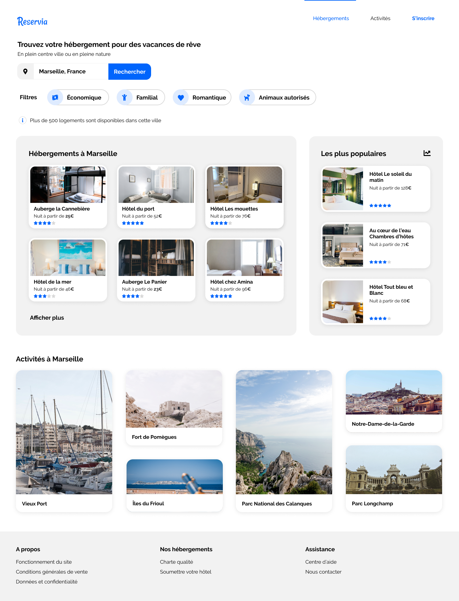
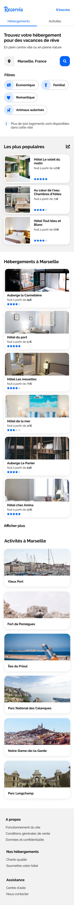

# Projet 2 OpenClassrooms "Transformez une maquette en site WEB"

c'est mon deuxième projet dans le cadre de ma formation **Developpeur Web**
___

## Démo

https://wala95.github.io/WalaZitoun_P2_26112020/

## Maquettes

Desktop:

Mobile:

## Cahier des charges

Réaliser la version web responsive en respectant les contraintes techniques suivantes :

- Code HTML et CSS séparés
- Utilisation des couleurs spécifiques:
	- Bleu = #0065FC
	- Bleu Claire = #DEEBFF
	- Gris (background) = #F2F2F2
- Utilisation d'une police spécifique: Raleway
- Utilisation des balises sémantiques 
- Utilisation du Flexbox et Grid
- Utilisation d'icones provenant de la bibliothèque Font Awesome 
- Design responsive et respect des maquettes Desktop et mobile fournies :
	- Une version "Desktop" pour un affichage sur des écrans de 1440px version Desktop
	- Une version "Mobile" pour un affichage sur les écrans de smartphone de 375px version Mobile
- Respect des fonctionnalité demandées
	- Chaque carte d'hébergement ou d'activité doit être cliquable dans son intégralité
	- Dans le menu, "Hébergements" et"Activités" sont des ancres menant aux sections correspondantes
	- Le champ de recherche doit être éditable
	- Les filtres doivent changer d'apparence au survol
	- Carte cliquables
- Validation du code HTML et CSS au validateur W3C sans erreurs
- Le code doit être versionné : github

